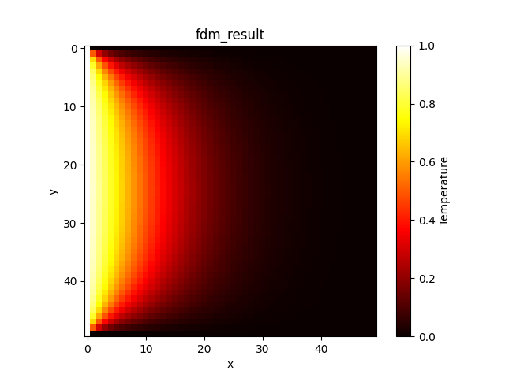
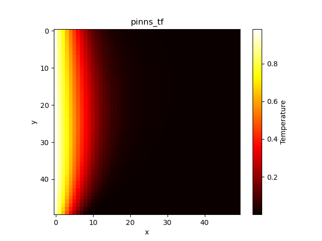
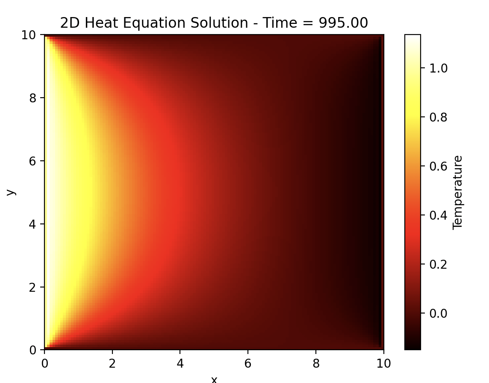
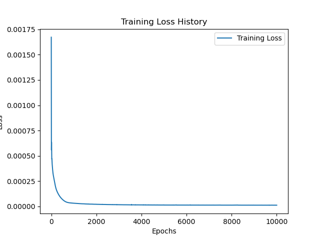

- [Introduction](#intro-control-ml)
- [Installation](#installation)
- [Loss and Notation](#loss-and-notation)
- [Results](#tested-results)
- [Fourier](#steps-to-derive-coefficient)

## intro-control-ml

This repository contains implementations based on the "Introduction to Control Systems and Machine Learning" lecture. It includes projects and code that apply concepts such as system dynamics, feedback control, and machine learning techniques to real-world problems.


## Installation

To run this project, you need the following dependencies:

- Python 3.10
- Required Python packages (listed in `requirements.txt`):


1. Fork the project

2. Clone the repository:
   ```bash
   git clone https://github.com/your_repository_name/intro-control-ml.git
   
3. go to the working directory
   ```bash
   cd intro-control-ml

4. create a virtual python enviroment
   ```bash
   python -m venv cml

5. active the virtual enviroment
   ```bash
   source cml/bin/active

6. You can install the required packages using:
    ```bash
    pip install -r requirements.txt

## Loss and Notation

### Notation

- $ \mathbf{x}_b, \mathbf{y}_b, \mathbf{t}_b $: Boundary points (spatial and temporal).
- $ u_b $: True boundary values at these points.
- $ \mathbf{x}_i, \mathbf{y}_i, \mathbf{t}_i $: Interior points of the domain (spatial and temporal).
- $ u(\mathbf{x}, \mathbf{y}, t) $: Neural network's predicted scalar output (e.g., temperature).
- $ \frac{\partial u}{\partial t} $: First-order time derivative of $ u $.
- $ \frac{\partial u}{\partial x}, \frac{\partial u}{\partial y} $: First-order spatial derivatives of $ u $.
- $ \frac{\partial^2 u}{\partial x^2}, \frac{\partial^2 u}{\partial y^2} $: Second-order spatial derivatives of $ u $.
- $ \alpha $: Thermal diffusivity constant (or similar parameter).
- $ \mathbf{x}_0, \mathbf{y}_0 $: Spatial points at the initial time $ t=0 $.
- $ u_0 $: True initial condition values at $ t=0 $.
- $ u_d $: True condition values at a future time $ t=1 $ (true value from finite difference method).
- $ N_b $: Number of boundary points.
- $ N_i $: Number of interior points.
- $ N_0 $: Number of points at the initial condition and finite difference result.


### Loss Function
$$
\text{Total Loss} = 
\frac{1}{N_b} \sum_{j=1}^{N_b} \left( u(\mathbf{x}_b^j, \mathbf{y}_b^j, t_b^j) - u_b^j \right)^2 + 
\frac{1}{N_i} \sum_{i=1}^{N_i} \left( \frac{\partial u}{\partial t_i} - \alpha \left( \frac{\partial^2 u}{\partial x_i^2} + \frac{\partial^2 u}{\partial y_i^2} \right) \right)^2 + \frac{1}{N_0} \sum_{k=1}^{N_0} \left( u(\mathbf{x}_0^k, \mathbf{y}_0^k, t=0) - u_0^k \right)^2 + 
\frac{1}{N_0} \sum_{k=1}^{N_0} \left( u(\mathbf{x}_0^k, \mathbf{y}_0^k, t=1) - u_d^k \right)^2
$$


## Tested results







## Steps to Derive Coefficient

### 1. Start with the Fourier Series
$$
g(x) = \sum_{n=-\infty}^\infty c_n e^{i 2 \pi n x / T}
$$

### 2. Multiply by $ e^{-i 2 \pi m x / T} $
To isolate a specific $ c_m $, multiply both sides by $ e^{-i 2 \pi m x / T} $:

$$
g(x) e^{-i 2 \pi m x / T} = \sum_{n=-\infty}^\infty c_n e^{i 2 \pi n x / T} e^{-i 2 \pi m x / T}
$$

### 3. Integrate Over One Period
Integrate both sides over one period, $ x \in [-T/2, T/2] $:

$$
\int_{-T/2}^{T/2} g(x) e^{-i 2 \pi m x / T} \, dx = \int_{-T/2}^{T/2} \sum_{n=-\infty}^\infty c_n e^{i 2 \pi (n - m) x / T} \ dx
$$

### 4. Use Orthogonality
The key property of Fourier series is **orthogonality**:

$$
\int_{-T/2}^{T/2} e^{i 2 \pi (n - m) x / T} \ dx =
\begin{cases} 
T, & \text{if } n = m, \\ 
0, & \text{if } n \neq m.
\end{cases}
$$

- For $ n = m $: The integral evaluates to $ T $.
- For $ n \neq m $: The integral evaluates to $ 0 $.

This means only the $ n = m $ term survives in the summation.

### 5. Isolate $ c_m $
On the left-hand side, we have:

$$
\int_{-T/2}^{T/2} g(x) e^{-i 2 \pi m x / T} \ dx
$$

On the right-hand side, only the $ n = m $ term survives:

$$
c_m \int_{-T/2}^{T/2} 1 \, dx = c_m T.
$$

Equating and solving for $ c_m $:

$$
c_m = \frac{1}{T} \int_{-T/2}^{T/2} g(x) e^{-i 2 \pi m x / T} \ dx
$$

### 6. Final Formula
For any integer $ n $, the Fourier coefficient is:

$$
c_n = \frac{1}{T} \int_{-T/2}^{T/2} g(x) e^{-i 2 \pi n x / T} \ dx
$$

---

## Key Insights
1. **Orthogonality of Exponentials**: The integral of $ e^{i 2 \pi (n - m) x / T} $ ensures that terms with different $ n $ vanish.
2. **Fourier Coefficients**: $ c_n $ captures the contribution of each frequency $ e^{i 2 \pi n x / T} $ to $ g(x) $.
3. **Periodicity**: This derivation assumes $ g(x) $ is periodic with period $ T $.

